##  一、安装步骤

### 1.下载node.js

官网网选择windows版本的下载即可：https://nodejs.cn/download

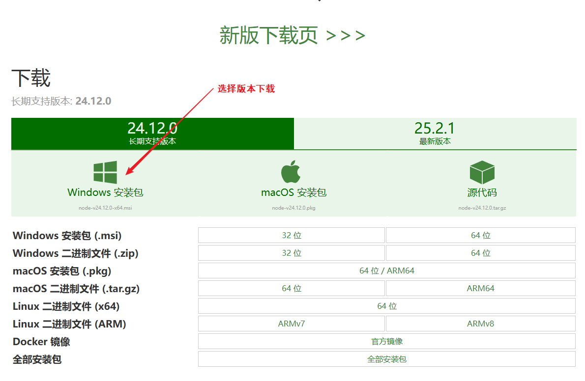


### 2.安装node.js

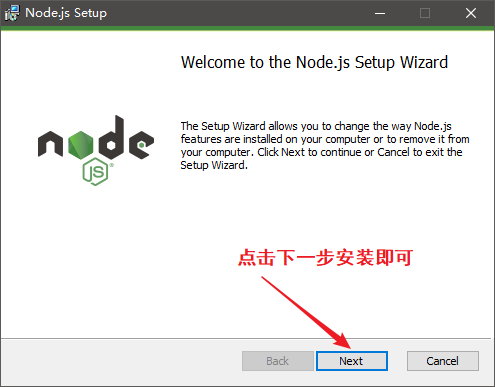


### 3.验证安装

WIN+R打开CMD管理员运行-->输入node -v , npm -v

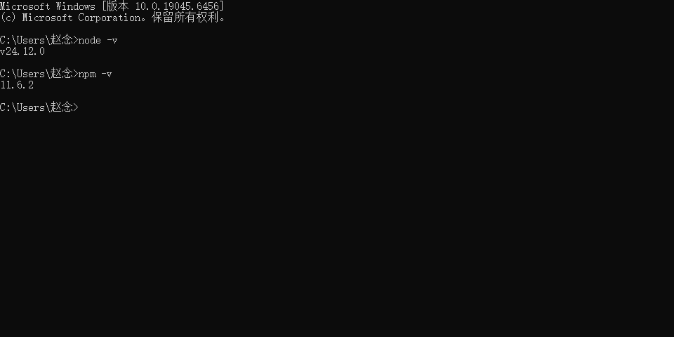


### 4,设置淘宝镜像源

由于网段原因，设置镜像源可以更快的访问hexo博客

输入命令行：

```CMD
npm install -g cnpm --registry=https://registry.npm.taobao.org 【MAC版本或Linux版本适用】
```

Windows版本：

```CMD
npm install -g cnpm --registry=https://registry.npmmirror.com
```

安装完成验证输入：cnpm(回车)

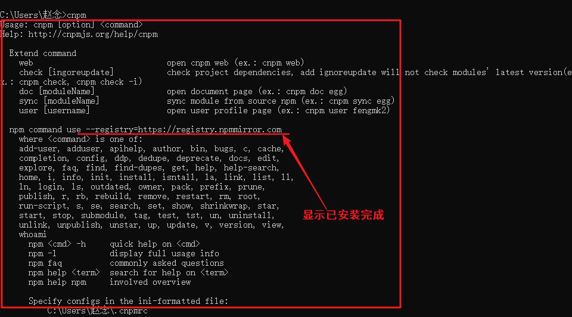

输入：

```
cnpm -v 【查看版本】
```

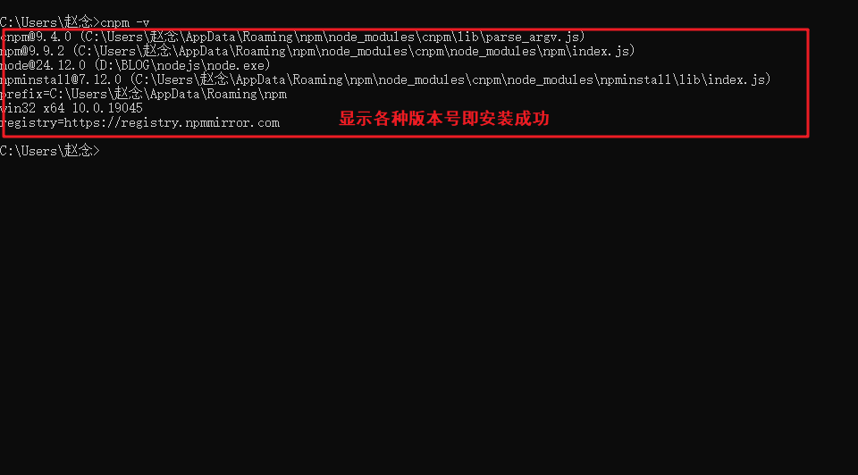


### 5.安装hexo

输入命令：

```
cnpm install -g hexo-cli
```

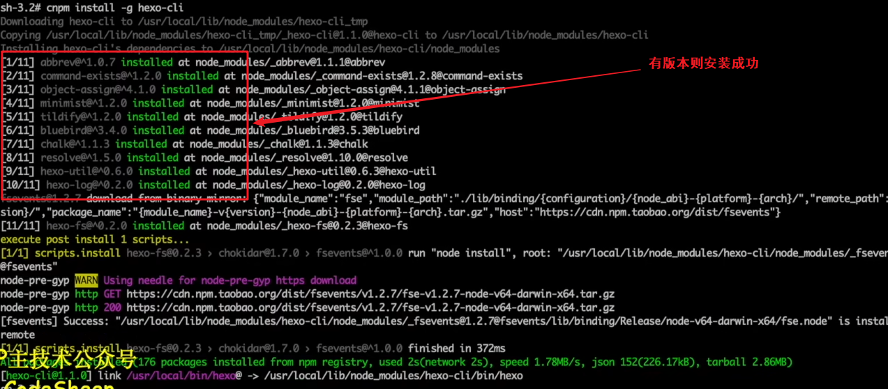

验证安装：

```
hexo -v
```

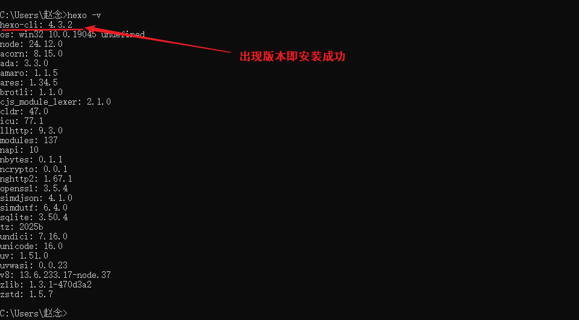


---

## 二、使用hexo

### 1.建立一个空的blog文件夹

```
CMD命令创建文件夹：

chdir #查看当前目录路径

D: #①选择盘符，进入D盘

dir #查看当前目录下的所有文件

mkdir BLOG/blog #创建blog文件夹

cd BLOG/blog #进入blog目录
```


### 2.初始化博客

进入blog目录下

CMD输入命令

```
hexo init #CMD

sudo hexo init #MAC或Linux版本
```

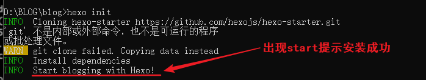

查看是否生成内容

```
dir 
```

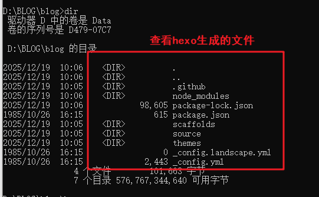


### 3.启动hexo

输入命令：

```
hexo s

hexo server #三种启动方法均可

npm run server
```

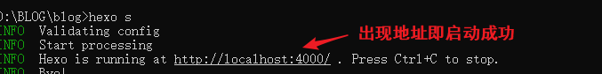


### 4.创建一篇文章

确保在blog目录下

输入命令：

```
hexo n "博客文章标题"
```

**文章路径默认为：blog/source/_posts/博客文章标题.md**

**打开文件可以使用VScode或者直接使用markdown打开编辑即可**


### 5.保存编辑好的文章

①退出server

②在blog目录下输入命令：

```
hexo clean #清理hexo

hexo g #生成hexo

hexo s #启动服务
```


### 6.遇到生成错误问题如何解决

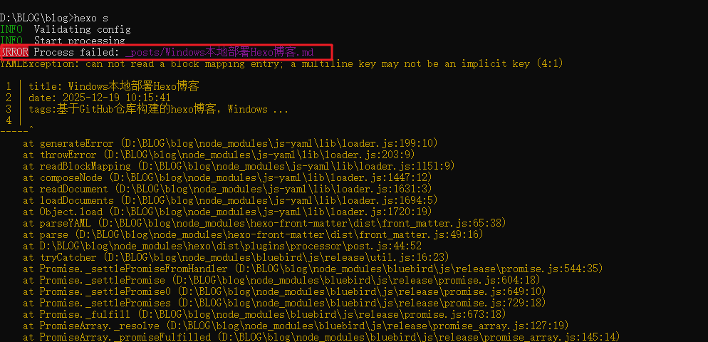

一般生成错误是因为语法格式问题出错

**填写时务必注意**：

- 每个冒号 `:` 后面**必须紧跟一个空格**。
- `tags` 和 `categories` 下的列表项（如 `- 标签1`）**必须用2个空格缩进**。
- 确保所有中英文标点符号为英文状态（尤其是冒号和空格）。

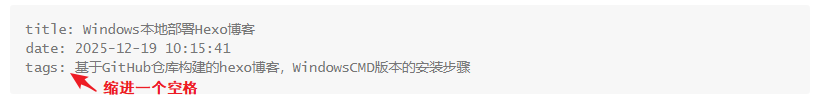

**正确格式为：**

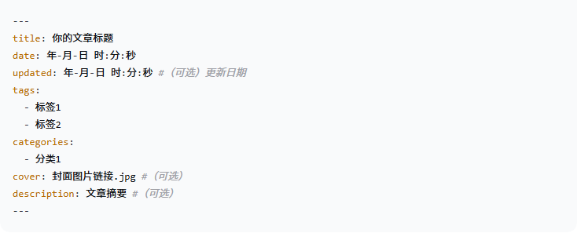


### 7.图片无法显示问题

#### 7.1**启用资源文件夹功能**
打开博客根目录下的 `_config.yml` 文件，找到 `post_asset_folder` 选项，将其值改为 `true`。

```
post_asset_folder: true
```

#### 7.2**为文章创建资源文件夹**

保存配置后，**以后**当你使用 `hexo new "文章标题"` 命令创建新文章时，Hexo会自动在 `source/_posts` 下生成一个 `文章标题.md` 文件**和一个同名的文件夹**（例如 `文章标题/`）。你可以把该文章用到的图片都放进这个文件夹。

*（对于已经存在的旧文章，你需要手动在 source/_posts 下创建一个与 .md 文件同名的文件夹。）*

#### 7.3**在文章中引用图片**

假设你的文章是 `/.md`，那么资源文件夹就是 ``。你把图片（比如 `setup.png`）放进去后，在Markdown中使用以下语法引用：

```

```

**注意：** 这里直接写文件名，**不要**加 `Windows_hexo_deploy/` 或任何绝对路径。

#### 7.4修改完成后重启hexo

顺序：清理--生成--启动服务

```
hexo clean 

hexo g

hexo s
```

#### 7.5倘若还是无法显示图片

输入命令下载图片依赖插件：

```
npm install hexo-asset-image --save
```

这个插件会自动将你在Markdown中写的图片相对路径，转换为部署后的正确绝对路径。

#### 7.6要是还是无法显示图片

可能是主题兼容问题导致的

更换一个新的主题试试


---

## 三、在GitHub上部署hexo

### 1.打开并登录GitHub

**新建仓库**

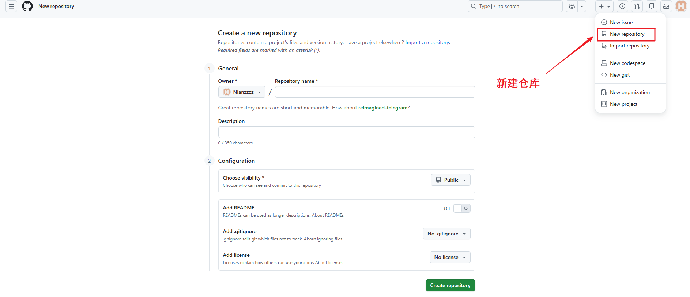

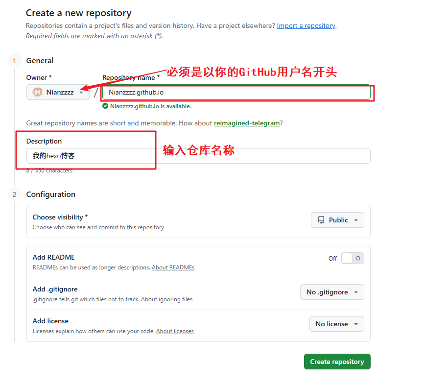

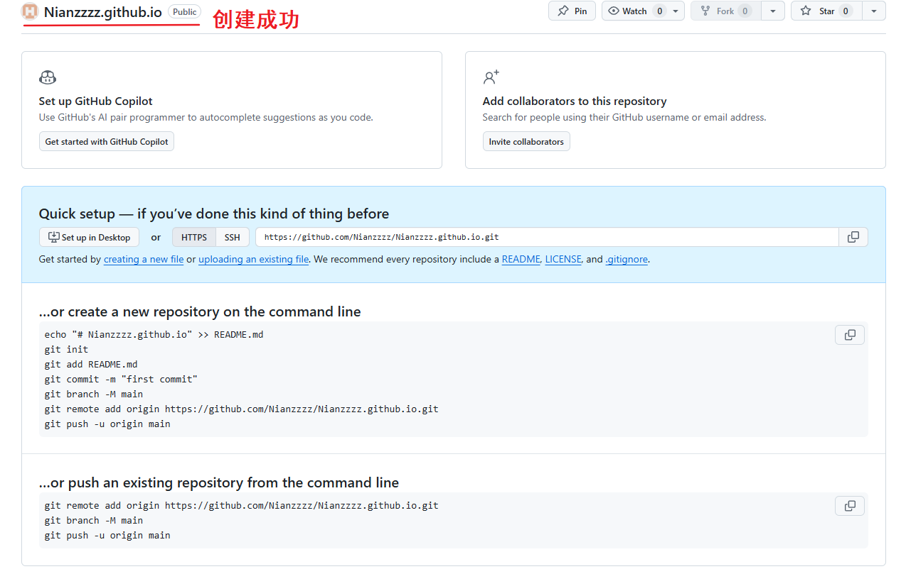


### 2.回到命令行下载git包

blog目录下输入：

```
cnpm install hexo-deployer-git --save 
```

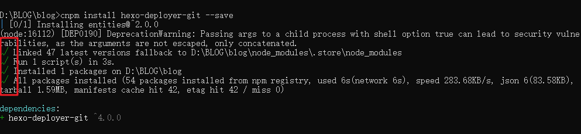


### 3.配置_config.yml文件

_config.yml文件在blog目录下可见

#### 3.1打开并修改如下：

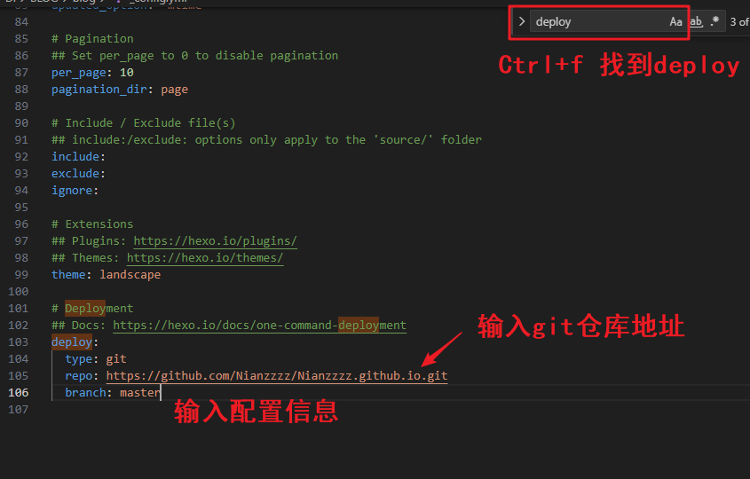

```
deploy:

  type: git

  repo: https://github.com/Nianzzzz/Nianzzzz.githubWindows_hexo_deploy.git #你的git仓库地址

  branch: master
```

**配置完成后保存**

#### 3.2继续回到命令行将hexo部署到远端：

输入命令：

```
hexo d
```

**部署失败将地址修改为SSH地址：**

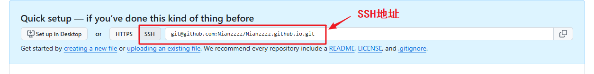

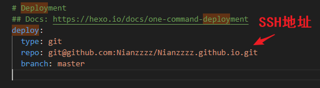

***安装失败请确保电脑已安装Git，否则需安装并配置其环境变量***

**部署成功返回：**

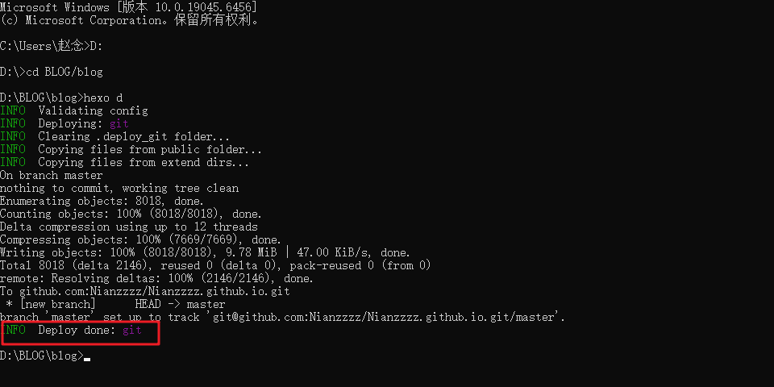

**部署失败原因：**

***GitHub SSH 密钥对配置一下即可***

