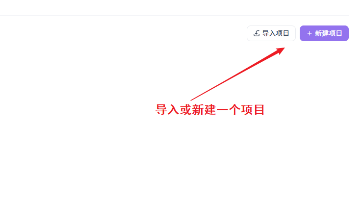
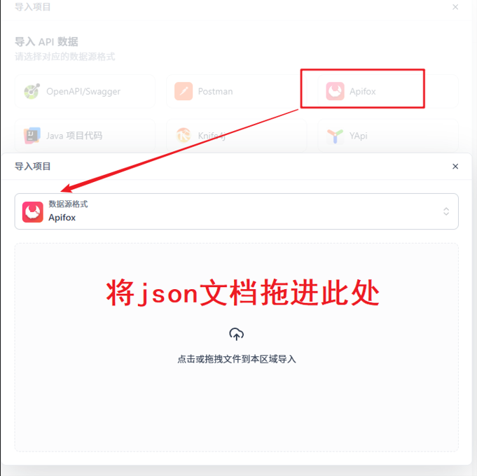
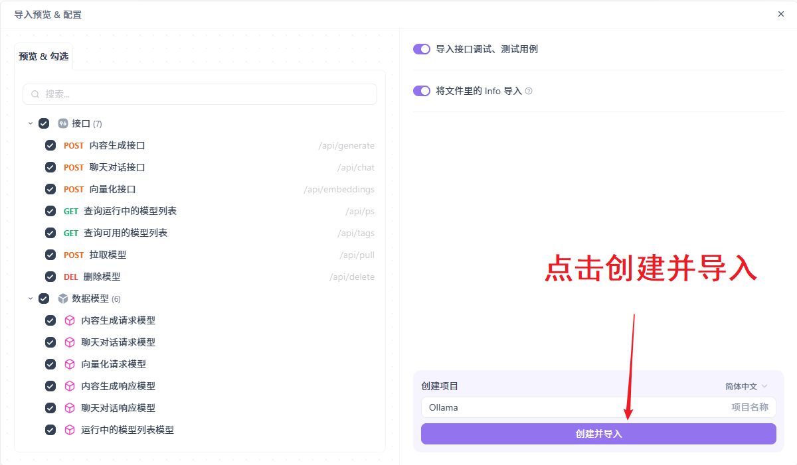
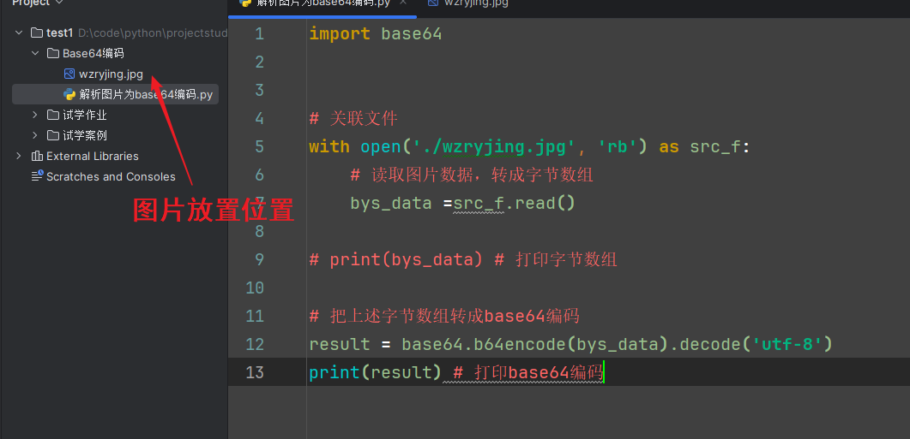
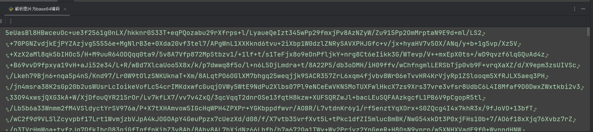
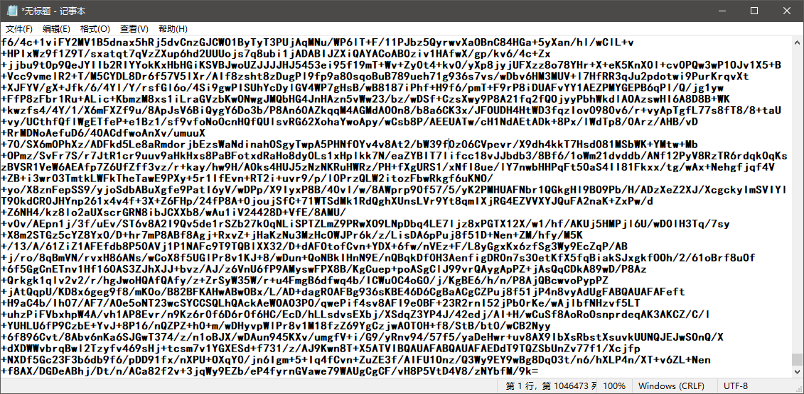
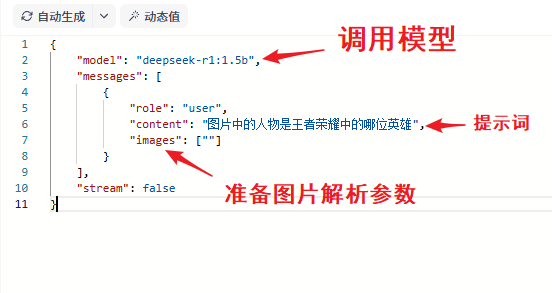
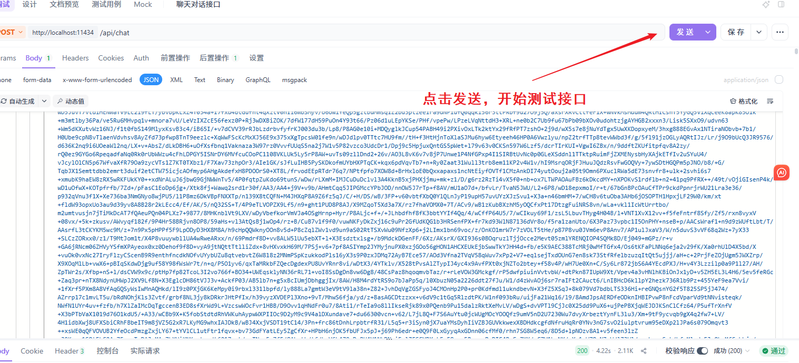
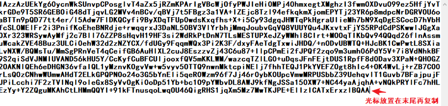
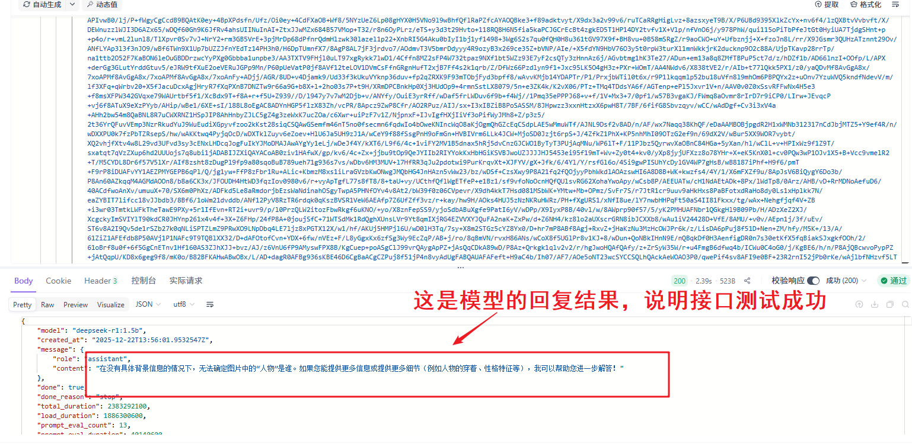

## 一、Apifox连接模型接口

### 导入模型接口文档：《Ollama.apifox.json》

**提前准备好json格式的接口文件**








---

## 二、编辑base64编码图片解析的python文件

```
import base64


# 关联文件
with open('./wzryjing.jpg', 'rb') as src_f:
    # 读取图片数据，转成字节数组
    bys_data =src_f.read()

# print(bys_data) # 打印字节数组

# 把上述字节数组转成base64编码
result = base64.b64encode(bys_data).decode('utf-8')
print(result) # 打印base64编码
```



### 复制打印结果：




---

## 三、开始解析

### 将图片base64格式的文档复制到记事本中以备使用



### 准备接口测试环境（准备必须参数）

```
{

​    "model": "deepseek-r1:1.5b", 

​    "messages": [

​        {

​            "role": "user",

​            "content": "图片中的人物是王者荣耀中的哪位英雄",

​            "images": [""]

​        }

​    ],

​    "stream": false

}
```



### 将准备好的文档粘贴进图片解析参数中



```
{

​    "error": "invalid character '\\r' in string literal"

}
```

***出现上述错误，是因为粘贴的base64编码的格式不对，注意记事本有无设置自动换行，取消自动换行即可***

***注意复制时光标需放在最后一个字符末尾，否则还是会识别换行***

***也要检查最前端是否有其他无关字符或空格存在***



### 测试接口成功：

